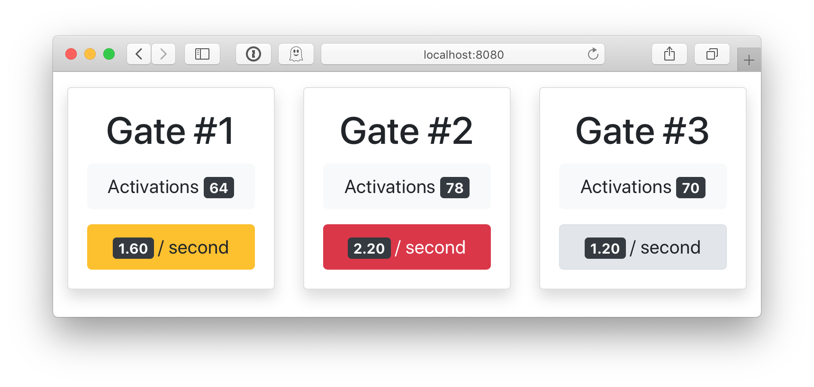

# Vert.x and Kafka gate activations demo

## Scenario

Each gate simulates people passing by.

Events are streamed to Kafka, and 2 verticles observe the events:

* 1 generates total counters of activations for each gate, and
* 1 computes throughput for each gate over periods of 5 seconds.

## Simple way to run

Start Kafka and ZooKeeper:

    $ docker-compose up

Then start the application:

    $ ./gradlew vertxRun

The open [http://localhost:8080/](http://localhost:8080/).

